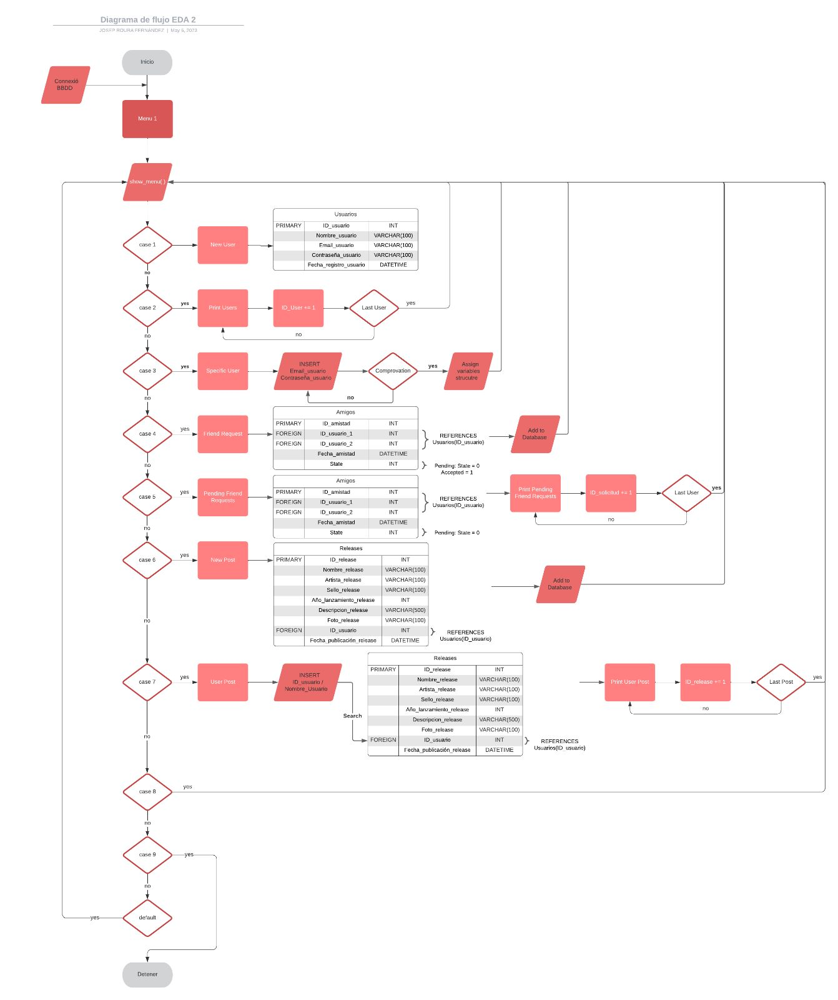

# Projecte-EDA-2---Replit

MEMORIA DE PROYECTO — EDA 2  

ERIC MATAS - U213904

JOSEP ROURA - U215081

FRANCISCO LUC - U213512 

**PROTOTIPO DE RED SOCIAL - TUNE NET**

**INTRODUCCIÓN**

En el contexto del curso académico, teníamos la tarea de desarrollar un prototipo de red social funcional utilizando los conocimientos adquiridos en programación. Nuestro objetivo ha sido crear una aplicación local en lenguaje C que combine creatividad y funcionalidad, permitiendo a los usuarios interactuar en un entorno virtual diseñado para compartir intereses, establecer conexiones y comunicarse de manera efectiva.

El planteamiento inicial del proyecto nos desafía a desarrollar una red social en consola, lo que nos brinda una oportunidad única para aplicar nuestros conocimientos de programación en un entorno práctico. En nuestro caso, hemos decidido hacer un prototipo de red social de **música**, donde se pueda compartir tus gustos musicales a través de publicaciones. Estas publicaciones constan de canciones o álbumes enteros donde se referencian datos como: el autor del tema, el año de publicación, el género al que pertenece y hasta un URL para escuchar la canción al momento de ver la publicación de otro usuario.

A lo largo del proceso, hemos definido una serie de objetivos obligatorios principales.

Uno de estos ha sido la implementación de estructuras de datos fundamentales, como Listas, una Pila o *Stack* y una Cola o *Queue*, que formarán parte de las diversas funcionalidades de la red social. Además, hemos aplicado distintos algoritmos para garantizar la eficiencia y la organización de los datos.

Como es el caso del algoritmo de búsqueda *LinearSearch,* el cual podemos encontrar* en diversas partes del código, y el algoritmo de ordenamiento *InsertionSort*.

Otro objetivo obligatorio cumplido ha sido la implementación funcional de un diccionario o una tabla hash, lo que nos ha permitido gestionar y acceder eficientemente a la información que teníamos almacenada.

En este caso lo hemos implementado en la sección de publicaciones.

En cuanto a la interacción con fuentes externas, hemos logrado leer datos de archivos de texto, lo que nos ha brindado la capacidad de importar información relevante y enriquecer la experiencia de los usuarios. Esta parte era un objetivo deseado que veíamos imprescindible implementar, por eso hemos decidido tener un archivo .txt en nuestro código con los datos de los usuarios registrados.

También hemos querido implementar una vista de grafos o árboles en la consola, permitiendo modelar las relaciones existentes entre los usuarios y las relaciones de amistad entre estos.

Por último comentar que, para fomentar la colaboración y mantener un flujo de trabajo constante, hemos utilizado el IDE online Replit enlazado con GitHub como nuestra plataforma de desarrollo. Esto nos ha permitido compartir y sincronizar nuestro código de manera efectiva, facilitando las actualizaciones y el seguimiento de los cambios realizados por cada miembro del equipo.

**OBJETIVOS DEL PROYECTO**

Empezaremos explicando los **objetivos obligatorios** que se plantearon desde un inicio en el proyecto:

**Objetivo obligatorio 1: Implementar como mínimo una Lista (*List*), una Pila (*Stack*) y una Cola (*Queue*) funcionales como parte de alguna de las funcionalidades del proyecto.**

Descripción general:

En este objetivo, se implementaron diferentes estructuras de datos para satisfacer las funcionalidades del proyecto de red social. Se utilizaron listas, una pila y una cola para almacenar y gestionar datos de usuarios y publicaciones.

Variables y estructuras de datos utilizadas:

Se implementaron diferentes listas dinámicas, como un array de usuarios (User users[MAX_USERS]) para almacenar la información de los usuarios registrados en la red social. Como también una pila (stack) de publicaciones mediante la estructura Publication* para almacenar las publicaciones realizadas por los usuarios. O una cola (queue) para almacenar las solicitudes de amistad.

Algoritmos utilizados:

No se menciona un algoritmo específico para la implementación de las listas, ya que son estructuras de datos fundamentales en las que se realizaron operaciones básicas de inserción y búsqueda.

Limitaciones y mejoras:

En cuanto a las listas implementadas, no se mencionan limitaciones específicas o áreas de mejora en el texto proporcionado.

Ubicación: El código relacionado con la implementación de las listas se encuentra disperso en diferentes partes del proyecto, como en la gestión de usuarios y publicaciones. Por ejemplo, las funciones *insert\_publication* y *create\_node* se utilizan para insertar nuevas publicaciones en la lista dinámica.

Tiempo estimado: 180 minutos.

**Objetivo obligatorio 2: Implementar funcionalmente uno de los algoritmos de búsqueda que se verán dentro del curso (*LinearSearch* o *BinarySearch*).**

Descripción general:

En este objetivo, se implementó el algoritmo de búsqueda *LinearSearch* en varias partes del código para buscar usuarios o contraseñas específicas en los arrays correspondientes.

Variables utilizadas:

Se utilizó una variable *usuario\_duplicado* con el propósito de verificar si se encontraba un usuario duplicado durante la búsqueda.

Algoritmo utilizado:

Se implementó el algoritmo de búsqueda *LinearSearch*, que consiste en recorrer linealmente una lista de elementos hasta encontrar el valor buscado. En este caso, se utilizó para buscar usuarios o contraseñas específicas en los arrays correspondientes.

Comportamiento esperado:

El algoritmo *LinearySearch* recorre secuencialmente la lista de elementos hasta encontrar una coincidencia con el valor buscado. En caso de encontrar la coincidencia, se establece la variable *usuario\_duplicado* en 1, indicando que se ha encontrado un usuario duplicado.

Limitaciones y mejoras:

El algoritmo *LinearSearch* tiene una complejidad lineal, por lo que su rendimiento puede disminuir significativamente en listas muy grandes. En este caso, dado que se trata de buscar usuarios en un array, no representa una limitación importante.

Una mejora potencial podría ser implementar una búsqueda más eficiente, como el algoritmo *BinarySearch*, que requiere que la lista esté ordenada previamente.

Pero en nuestro caso no fue utilizado porque hubiésemos necesitado que los usuarios estuviesen ordenados previamente. Y cuando desarrollamos este algoritmo de búsqueda aún no habíamos desarrollado ningún algoritmo de ordenamiento.

Ubicación: El código relacionado con la implementación del algoritmo *LinearSearch* se encuentra en diferentes partes del proyecto, donde se realizan las búsquedas de usuarios o contraseñas en los arrays correspondientes.

Tiempo estimado: 30 minutos.

**Objetivo obligatorio 3: Implementar funcionalmente uno de los algoritmos de ordenamiento que se verán a lo largo del curso (*InsertionSort*, *BubbleSort*, *MergeSort* o *QuickSort*).**

Descripción general:

En este objetivo, se implementó el algoritmo de ordenamiento *InsertionSort* para ordenar los usuarios por orden alfabético en el proyecto de red social.

Variables utilizadas:

Se utilizó una variable *key* para almacenar el usuario actual durante el proceso de inserción en el algoritmo *InsertionSort*.

También se utilizaron variables *i* y *j* como índices para recorrer el array de usuarios y realizar las comparaciones necesarias.

Algoritmo utilizado:

Se implementó el algoritmo de ordenamiento *InsertionSort*, que consiste en dividir el array en una parte ordenada y otra desordenada, e ir insertando cada elemento de la parte desordenada en la parte ordenada en su posición correcta.

Comportamiento esperado:

El algoritmo *InsertionSort* recorre el array de usuarios a partir del segundo usuario. Para cada usuario, se compara con los usuarios anteriores en el array y se realiza el desplazamiento hacia la derecha hasta encontrar su posición correcta en la parte ordenada del array.

Limitaciones y mejoras:

El algoritmo *InsertionSort* tiene una complejidad de tiempo cuadrática, lo que significa que puede ser ineficiente en listas muy grandes. Sin embargo, dado que se utiliza para ordenar un array de usuarios en este proyecto, no representa una limitación significativa.

Una mejora potencial podría ser implementar un algoritmo de ordenamiento más eficiente, como *MergeSort* o *QuickSort*, que tienen una complejidad de tiempo inferior en promedio.

Ubicación: El código relacionado con la implementación del algoritmo *InsertionSort* se encuentra en una función denominada *insertion\_sort\_users*, donde se realiza el proceso de ordenamiento de los usuarios en el array correspondiente.

Tiempo estimado: 60 minutos.

**Objetivo obligatorio 4: Implementar o bien un Diccionario (*Dictionary*) o bien una tabla Hash (*HashTable*) funcionales.**

Descripción general:

En este objetivo, se implementó un diccionario para las publicaciones del proyecto de red social. El diccionario se utilizó para contar las palabras utilizadas en las publicaciones y generar un ranking de las palabras más utilizadas.

Variables utilizadas:

Se utilizó una estructura *w\_count* para representar cada palabra y su contador de frecuencia en las publicaciones.

Se utilizó un array *dictionary* para almacenar las palabras y sus contadores de frecuencia.

También se utilizó una variable *n\_words* para realizar un seguimiento del número total de palabras diferentes en las publicaciones.

Algoritmo utilizado:

Se implementaron algoritmos simples para agregar palabras al diccionario y generar un ranking de las palabras más utilizadas. El proceso de agregar palabras al diccionario se realiza mediante la función *add\_word*, y la generación del ranking se realiza mediante la función *ranking\_words*.

Comportamiento esperado:

El algoritmo *add\_word* verifica si una palabra ya está en el diccionario y actualiza su contador de frecuencia. Si la palabra no está en el diccionario, se agrega con un contador de frecuencia inicial de 1.

El algoritmo *ranking\_words* ordena el diccionario por frecuencia descendente y muestra las 10 palabras más utilizadas en las publicaciones.

Limitaciones y mejoras:

El diccionario implementado tiene algunas limitaciones, como el tamaño fijo del array *dictionary* y la falta de manejo de colisiones en caso de que dos palabras diferentes tengan la misma clave hash.

Una mejora potencial sería implementar una estructura de tabla hash más robusta con manejo de colisiones, lo que permitiría un almacenamiento y búsqueda eficientes de las palabras en el diccionario.

Ubicación: El código relacionado con la implementación del diccionario se encuentra en las funciones *add\_word* y *ranking\_words*, donde se agrega una palabra al diccionario y se genera el ranking de palabras, respectivamente.

Tiempo estimado: 240 minutos.

**Objetivo obligatorio 5: Comentar todas las partes importantes del código.**

Descripción general:

En este objetivo, se cumple con el requisito de comentar todas las partes importantes del código, incluyendo funciones, ciclos, secciones de código con una funcionalidad definida y secciones con lógica difícil de entender a simple vista.

Variables utilizadas:

No se especificaron variables adicionales para este objetivo, ya que se refiere a la práctica de comentar el código existente.

Algoritmo utilizado:

No se especifica un algoritmo en sí, sino más bien una práctica de documentación y 

comentado del código existente.

Comportamiento esperado:

Al comentar todas las partes importantes del código, se mejora la comprensión y legibilidad del mismo para los desarrolladores y futuros mantenedores del proyecto.

Limitaciones y mejoras:

No se especifican limitaciones ni mejoras relacionadas con este objetivo, ya que se trata de una práctica estándar de desarrollo de software.

Ubicación: Los comentarios del código se encuentran distribuidos a lo largo de los archivos correspondientes, cubriendo las partes importantes del código.

**Objetivo obligatorio 6: Usar GitHub para que todos los miembros del equipo puedan trabajar a la par y más cómodamente.**

Descripción general:

En este objetivo, se utilizó GitHub como plataforma de control de versiones para permitir que todos los miembros del equipo trabajen en el proyecto de manera colaborativa y coordinada. Se realizaron actualizaciones constantes del código a través de GitHub para mantener un registro de los cambios y facilitar la colaboración.

Variables utilizadas:

No se especifican variables adicionales para este objetivo, ya que se refiere al uso de la plataforma GitHub como herramienta de colaboración.

Algoritmo utilizado:

No se especifica un algoritmo en sí, sino más bien una práctica de uso de la plataforma GitHub.

Comportamiento esperado:

Al utilizar GitHub como plataforma de control de versiones, se permite a los miembros del equipo trabajar de forma concurrente en el código, realizar cambios y actualizaciones sin interferir con el trabajo de otros, y mantener un registro de los cambios realizados.

Limitaciones y mejoras:

No se especifican limitaciones ni mejoras relacionadas con este objetivo, ya que el uso de GitHub es una práctica estándar en el desarrollo de proyectos colaborativos.

Ubicación: Las actualizaciones del código a través de GitHub se realizaron en el repositorio correspondiente al proyecto. Los detalles específicos sobre la ubicación exacta del código y los archivos en GitHub dependerán de la estructura y organización del repositorio utilizado por el equipo.

Una vez comentados todos los objetivos obligatorios alcanzados en nuestro proyecto, ahora iremos con la implementación de algunos **objetivos deseables**:

**Objetivo Deseable 1: Leer datos de una fuente externa como un archivo de texto o CSV.**

Descripción general:

En este objetivo deseable, se implementa la lectura de datos de una fuente externa, en este caso, un archivo de texto. Para ello, se utiliza la función *fopen* para abrir el archivo en modo lectura y se verifica si se pudo abrir correctamente. Luego, se cuenta el número de líneas en el archivo para determinar la posición donde se agregarán los nuevos datos. Se utiliza la función *fgetc* para leer cada carácter del archivo y contar las líneas. Una vez contadas las líneas, se vuelve a abrir el archivo en modo escritura y se verifica si se pudo abrir correctamente. Se obtiene la fecha actual utilizando la función strftime y se escriben los datos en el archivo utilizando la función *fprintf*. Finalmente, se cierra el archivo.

Variables utilizadas y su propósito:

*archivo*: Puntero al archivo que se va a abrir.

*lineas*: Contador de líneas en el archivo.

*caracte*r: Carácter leído del archivo.

*fechaActual*: Cadena de caracteres que almacena la fecha actual.

*tiempoActual*: Variable que almacena el tiempo actual.

*fecha*: Estructura que almacena la fecha descompuesta en componentes.

Estructuras de datos utilizadas:

No se utilizan estructuras de datos adicionales para este objetivo. Se utilizan variables simples y arrays de caracteres para almacenar los datos leídos del archivo.

Algoritmo elegido y comportamiento esperado:

El algoritmo utilizado consiste en abrir el archivo en modo lectura, contar las líneas, abrir el archivo en modo escritura, obtener la fecha actual, escribir los datos en el archivo y cerrar el archivo. El comportamiento esperado es que los datos leídos del archivo se agreguen correctamente en una nueva línea al final del archivo.

Limitaciones del algoritmo y su implementación:

Una limitación del algoritmo es que asume que el archivo de entrada está en un formato específico y que los datos se encuentran en un orden predefinido. Además, no se realizan validaciones exhaustivas sobre los datos leídos, lo que podría llevar a errores si los datos no cumplen con el formato esperado. La implementación también asume que el archivo existe y se encuentra en la ruta especificada.

Mejoras posibles:

Realizar validaciones de formato y datos para garantizar la integridad de los datos leídos.

Manejar casos de error de manera más robusta, mostrando mensajes de error específicos.

Separar la funcionalidad de lectura y escritura en funciones independientes para mejorar la modularidad y reutilización del código.

Utilizar estructuras de datos más adecuadas para almacenar los datos leídos, como listas enlazadas o matrices.

Ubicación en el código: Esta implementación se encuentra en varios lugares del código relacionados con la lectura y escritura de datos de usuarios y publicaciones, tanto en el archivo "main.c" como en otros archivos relacionados.

Tiempo estimado: 180 minutos.

**Objetivo Deseable 2: Tematización de la red social.**

Descripción general:

En este objetivo deseable, se implementa la tematización de la red social, centrándola en el tema de la música. Esto se logra mediante la captura de datos relacionados con la música, como géneros favoritos, álbumes, canciones, año de publicación de canciones en concreto, breves descripciones, etc. 

Además se ha añadido unos términos de uso de la propia red social de música que le añaden realismo al proyecto.

Variables utilizadas y su propósito:

*generosFavoritos*: Lista de géneros musicales favoritos del usuario.

*albums*: Lista de álbumes que el usuario ha escuchado o desea escuchar.

*canciones*: Lista de canciones que el usuario ha escuchado o desea escuchar.

*artistasFavoritos*: Lista de artistas musicales favoritos del usuario.

*reproduciendo*: Variable que almacena la canción que se está reproduciendo actualmente.

Estructuras de datos utilizadas:

Se utilizan listas (arrays o listas enlazadas) para almacenar los géneros favoritos, álbumes, canciones y artistas favoritos del usuario.

Algoritmo elegido y comportamiento esperado:

El algoritmo utilizado consiste en capturar los datos relacionados con la música del usuario, permitirle buscar artistas, reproducir canciones y recibir recomendaciones de música basadas en sus preferencias. El comportamiento esperado es que el usuario pueda interactuar con la red social y realizar acciones relacionadas con la música, como agregar géneros favoritos, buscar artistas, reproducir canciones, etc.

Limitaciones del algoritmo y su implementación:

La implementación actual asume que los datos relacionados con la música se capturan de manera manual por parte del usuario, lo cual puede ser un proceso tedioso y propenso a errores.

No se considera la integración con servicios externos de música, como APIs de streaming, para obtener datos y realizar acciones relacionadas con la música.

No se implementa un algoritmo de recomendación de música avanzado que utilice técnicas de aprendizaje automático para sugerir música basada en las preferencias del usuario.

Mejoras posibles:

Integrar la aplicación con servicios de música populares, como *Spotify* o *Apple Music*, para obtener datos y realizar acciones relacionadas con la música de manera más automatizada.

Implementar un algoritmo de recomendación de música más sofisticado que utilice técnicas de aprendizaje automático, como filtrado colaborativo o análisis de contenido, para sugerir música basada en las preferencias del usuario.

Mejorar la interfaz de usuario y la experiencia de usuario relacionada con la tematización de la red social, facilitando la búsqueda de artistas, reproducción de canciones, etc.

Permitir que los usuarios compartan y descubran música entre ellos, creando una comunidad musical dentro de la red social.

Ubicación en el código: Esta implementación se encuentra en varios lugares del código relacionados con la interacción del usuario con la red social y la gestión de datos relacionados con la música, como la adición de géneros favoritos, búsqueda de artistas, reproducción de canciones, etc.

Tiempo estimado: 60 minutos.

**Objetivo Deseable 3: Implementar adicionalmente una vista (por consola) de Grafos (Graphs) o árboles (Trees) que modele cualquiera de las relaciones existentes entre los datos (Contactos, mensajes, intereses, etc…)**

Descripción general:

En este objetivo deseable, se implementa la visualización de la red social en forma de grafo utilizando la biblioteca "grapheasy". Se definen las estructuras de datos *UserData* y *FriendshipData* para almacenar la información de los usuarios y las amistades respectivamente. Se crean funciones para crear el grafo, leer los datos de usuarios y amistades desde archivos, imprimir el grafo y guardar el grafo como una imagen.

Variables utilizadas y su propósito:

*UserData*: Estructura de datos que almacena la información de un usuario, incluyendo el nombre de usuario.

*FriendshipData*: Estructura de datos que almacena la información de una amistad, incluyendo el identificador de amistad, los identificadores de los usuarios involucrados, la fecha y el estado de la amistad.

*createGraph*: Función que inicializa un grafo vacío.

*readUsersFile*: Función que lee los datos de usuarios desde un archivo y los agrega al grafo.

*readFriendsFile*: Función que lee los datos de amistades desde un archivo y agrega las relaciones al grafo.

*printGraph*: Función que imprime la representación del grafo en la consola.

*saveGraphAsImage*: Función que guarda el grafo como una imagen en formato DOT.

Estructuras de datos utilizadas:

*UserData*: Estructura que almacena la información de un usuario.

*FriendshipData*: Estructura que almacena la información de una amistad.

Algoritmo elegido y comportamiento esperado:

El algoritmo utilizado consiste en crear un grafo vacío, leer los datos de usuarios desde un archivo y agregarlos al grafo como nodos. Luego, se leen los datos de amistades desde otro archivo y se agregan las relaciones al grafo como aristas. Finalmente, se puede imprimir el grafo en la consola o guardar el grafo como una imagen en formato DOT. El comportamiento esperado es que se muestre la representación visual del grafo, ya sea en la consola o como una imagen.

Limitaciones del algoritmo y su implementación:

Una limitación del algoritmo es que asume que los archivos de usuarios y amistades tienen un formato específico y que los datos se encuentran en un orden predefinido. Además, no se realizan validaciones exhaustivas sobre los datos leídos, lo que podría llevar a errores si los datos no cumplen con el formato esperado. La implementación también asume que los archivos existen y se encuentran en las rutas especificadas.

Mejoras posibles:

Realizar validaciones de formato y datos para garantizar la integridad de los datos leídos.

Manejar casos de error de manera más robusta, mostrando mensajes de error específicos.

Implementar algoritmos de diseño de grafo más sofisticados para mejorar la visualización de la red social.

Permitir interacciones con el grafo, como agregar o eliminar nodos y aristas.

Ubicación en el código: Este objetivo deseable se encuentra implementado en los archivos "grafs.h" y "grafs.c". Las funciones correspondientes se llaman desde el archivo "main.c" para crear, leer, imprimir y guardar el grafo.

Tiempo estimado: 180 minutos.

**SOLUCIÓN**

En esta sección, profundizaremos en la solución desarrollada para el proyecto de prototipo de red social. La solución abarca la arquitectura del sistema, la gestión de errores, el diseño del modelo de datos y el procesamiento del conjunto de datos.

Arquitectura del sistema:

La arquitectura del sistema se basa en una estructura modular que permite una separación clara de las diferentes funcionalidades y componentes del proyecto. A continuación, se presenta un diagrama de la arquitectura del sistema:

El sistema está compuesto por una aplicación en lenguaje C que se ejecuta en la consola y ofrece una interfaz de usuario interactiva a través de menús. Los menús permiten a los usuarios acceder a diferentes funcionalidades, como gestionar usuarios, crear publicaciones, buscar usuarios, etc.

La gestión de usuarios y publicaciones se realiza mediante estructuras de datos como listas, pilas y colas. Estas estructuras permiten almacenar y manipular los datos de manera eficiente. Por ejemplo, se utiliza una lista para almacenar los usuarios registrados y una cola para gestionar las publicaciones.

Además, el sistema cuenta con una capa de abstracción de datos que encapsula las operaciones relacionadas con las estructuras de datos. Esto facilita la reutilización del código y mejora la organización del proyecto.

En un inicio creamos este diagrama de la arquitectura de lo que iba a ser nuestro proyecto de red social en C:

Gestión de errores:

En cuanto a la gestión de errores, se han implementado diferentes mecanismos para manejar situaciones inesperadas y garantizar la estabilidad del sistema. Algunas de las estrategias utilizadas han sido:

Validación de entradas: Se realizaron comprobaciones de los datos ingresados por el usuario para garantizar que sean válidos y cumplan con los requisitos establecidos. 

Mensajes de error descriptivos: Cuando se produce un error, gracias al IDE utilizado, en nuestro caso Replit, se muestra un mensaje descriptivo en la consola para informar al usuario sobre el problema y proporcionar orientación sobre cómo solucionarlo. Estos mensajes de error se han diseñado para ser claros y comprensibles, brindando información útil al usuario.

Diseño del modelo de datos:

El diseño del modelo de datos se basa en las necesidades específicas del proyecto de prototipo de red social. 

En el caso de nuestro proyecto definimos los siguientes elementos importantes: 

Entidades principales:

Usuario: Representa a un usuario registrado en la red social. Puede tener atributos como ID, nombre, correo electrónico, contraseña, fecha de registro, etc. Además, puede tener relaciones con otras entidades, como amigos, publicaciones y comentarios.

Amigo: Es una relación que representa la amistad entre dos usuarios. Puede tener atributos adicionales, como fecha de amistad, estado de la solicitud de amistad, etc.

Publicación: Representa una publicación realizada por un usuario en la red social. Puede tener atributos como ID, título, contenido, fecha de publicación, etc. Además, puede estar asociada a otros objetos, como comentarios, me gusta y etiquetas.

Relaciones y asociaciones:

Usuario-Amigo: Es una relación de muchos a muchos entre usuarios, que representa la amistad entre ellos. Esta relación se puede implementar mediante una tabla intermedia que almacene los ID de los usuarios amigos y otros atributos relevantes, como el estado de la solicitud de amistad.

Usuario-Publicación: Es una relación de uno a muchos entre usuarios y publicaciones, ya que un usuario puede tener varias publicaciones. La relación se puede implementar agregando un campo de usuario ID en la tabla de publicaciones.

Procesamiento del conjunto de datos:

El procesamiento del conjunto de datos se refiere a la manipulación y gestión de la información ingresada por los usuarios. A continuación, se describen algunas de las funcionalidades relacionadas con el procesamiento de datos implementadas en el proyecto:

Registro de usuarios: Los usuarios pueden registrarse proporcionando su nombre, correo electrónico y contraseña. Estos datos se validan y se crean instancias de objetos de la clase Usuario con la información correspondiente. Estos objetos se agregan a la lista de usuarios registrados.

Inicio de sesión: Los usuarios pueden iniciar sesión ingresando su correo electrónico y contraseña. Se verifica la existencia del usuario y la coincidencia de la contraseña. Si los datos son correctos, el usuario inicia sesión y puede acceder a las funcionalidades adicionales.

Creación de publicaciones: Los usuarios pueden crear publicaciones ingresando un título y contenido. Estas publicaciones se agregan a la cola de publicaciones, donde se mantienen en espera para ser procesadas y mostradas en el feed de noticias.

Búsqueda de usuarios: Los usuarios pueden buscar a otros usuarios por su nombre o correo electrónico. Se realiza una búsqueda en la lista de usuarios registrados y se muestra una lista de resultados coincidentes.

Agregar amigos: Los usuarios pueden agregar amigos a su lista de amigos. Para ello, se selecciona un usuario de la lista de resultados de búsqueda y se envía una solicitud de amistad. Si el otro usuario acepta la solicitud, se actualizan las listas de amigos de ambos usuarios.

Estas son solo algunas de las funcionalidades implementadas en el prototipo de red social. La solución se podría expandir y mejorar con nuevas características, como la capacidad de comentar publicaciones, enviar mensajes privados, personalizar perfiles, etc.
